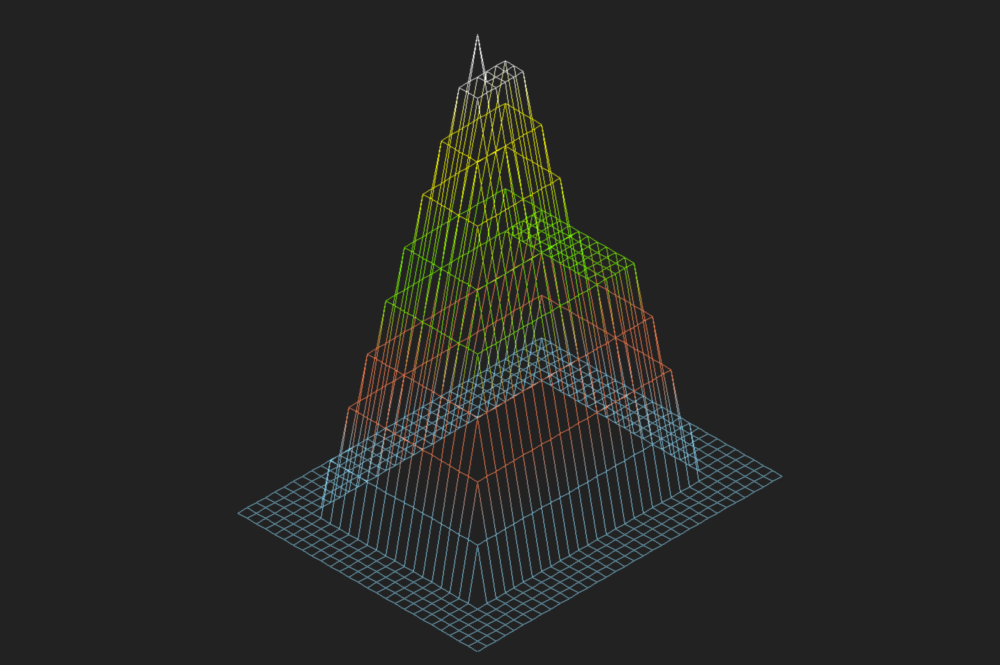

# Hive-FdF

This repository is transferred from Hive Helsinki Vogsphere.

The orignal date is Feb 3, 2020. The score is 122/100. 

All programs that you wrote until now were executed in text mode on your terminal. Now, let’s discover something more exciting: how to open a graphic window and draw inside? To start your journey in graphic programming, FdF offers to visualize “iron wire” meshing in 3D.

